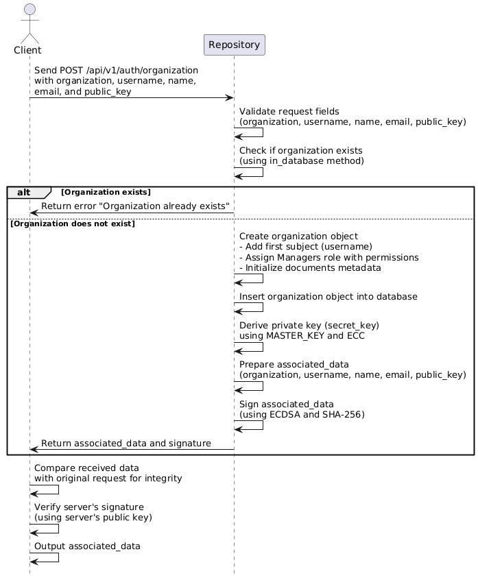
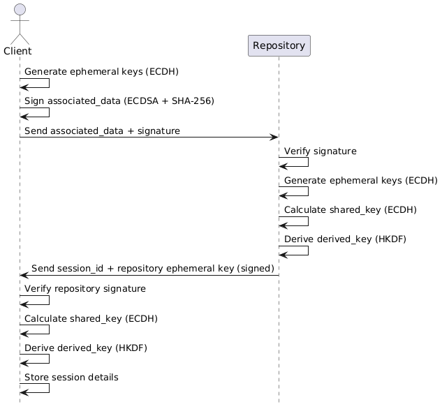
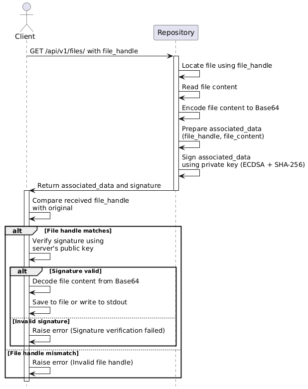
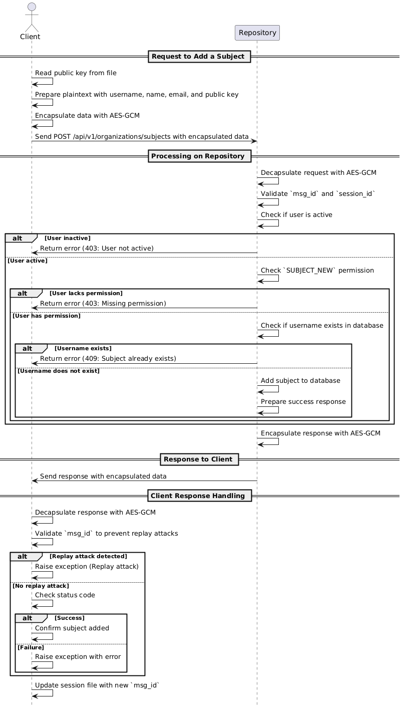

### **1. Introduction**

This project aims to develop a secure repository for managing organizational documents. We used **MongoDB** as the primary database for its flexibility in handling data, and **Docker** to simplify deployment. The `docker-compose.yml` file configures the MongoDB service with authentication and persistent storage, alongside the Flask application for seamless integration.

To run the system:  
- **Server**: Launch the server by running: 
  ```bash
  docker compose up --build
  ```  
- **Client**: Execute commands by running:  
  ```bash
  python3 subject.py <command> <args>
  ```  

---

### **2. Secure Operations**

The following sequence diagrams illustrate the secure workflows implemented in the project.

### **2.1 Local commands**

1. **Creating a Subject**  
   The process for creating a subject involves deriving a private key from the password using ECC (Elliptic-curve Cryptography), generating a public key, and securely storing the information in the organization’s database.  

### **2.2 Commands that use the anonymous API**

We chose to explain the workflow of creating an organization, creating a session, and downloading a file as examples of the commands that use the anonymous API.

1. **Creating an Organization**  
   The workflow for creating an organization includes securely sending the organization data to the server, storing it in the database, and validating the response.  
   

    <!-- creating_organization -->

2. **Creating a Session**  
   The process of creating a session ensures secure communication between the client and the server using a combination of cryptographic processes:

   1. **Client-Side Key Generation**:  
      The client generates an ephemeral private key derived from their private key (itself derived from the password) and computes the corresponding ephemeral public key.

   2. **Wrapping and Signing Data**:  
      The client creates the `associated_data`, which includes the `organization`, `username`, and `client_ephemeral_public_key`. This data is signed using **ECDSA** (Elliptic Curve Digital Signature Algorithm) with **SHA-256** to ensure authenticity and integrity. The signed data, along with the `associated_data`, is sent to the server.

   3. **Server-Side Verification and Key Exchange**:  
      The server verifies the client's signature using the client's public key. It then generates its own ephemeral private and public keys. Using **ECDH** (Elliptic Curve Diffie-Hellman), the server calculates a `shared_key` based on its ephemeral private key and the client's ephemeral public key.

   4. **Key Derivation for Encryption**:  
      The `shared_key` is processed with **HKDF** (HMAC-based Key Derivation Function) to derive a `derived_key`, adding an additional layer of cryptographic protection for the session.

   5. **Session Information and Response**:  
      The server stores the session details and sends back the `session_id` and its `ephemeral_public_key`, signed with the server's private key to ensure authenticity.

   6. **Client Verification and Storage**:  
      The client verifies the server’s signature using the server's public key. It computes the `shared_key` and derives the same `derived_key` using the server’s ephemeral public key. Finally, the session details are saved to a `session_file` on the client side for future use.

   These cryptographic processes are illustrated in the sequence diagram below.  
   
   
   <!-- creating_session -->

3. **Communicating with the Repository**

   To illustrate the secure communication mechanisms in the Repository, we provide an example of how a file is downloaded using its handle.
   The workflow for downloading a file ensures the integrity and authenticity of the retrieved content. The client requests the file using its handle, and the server locates the file and returns its content along with a cryptographic signature. The signature, generated using the server's private key, allows the client to verify the authenticity and integrity of the file, ensuring it has not been tampered with during transmission. Upon successful validation, the client can write the file content to a specified location or output it to stdout.

     

   <!-- downloading_file -->

### **2.3 Commands that use the authenticated API**


### **Secure Communication Workflow**

The secure communication between the client and server is achieved through a systematic process involving **data encapsulation**, **data transmission**, and **data decapsulation**. This ensures confidentiality, integrity, and protection against replay attacks.

### **Encryption Details**

- **Algorithm**: **AES-GCM** (Advanced Encryption Standard in Galois/Counter Mode) is used for both encryption and decryption. It ensures data confidentiality and integrity.
- **Keys**: The `derived_key` for encryption and decryption is established securely during session creation using **ECDH** and **HKDF**.
- **Associated Data**: This additional data (e.g., `msg_id` and `session_id`) is authenticated during encryption but not encrypted itself, preventing tampering.

Here is how it works:

---

1. **Client-Side Data Encapsulation**:
   - The client begins by preparing the data (`plaintext`) to be sent. 
   - Session-related metadata (`msg_id` and `session_id`) are grouped into `associated_data`, which is authenticated but not encrypted.
   - The `plaintext` is serialized into bytes and encrypted using the **AES-GCM** algorithm with the `derived_key`. The encryption process generates a random `nonce` and produces the `ciphertext`, ensuring confidentiality and integrity.
   - Both the `associated_data` and the encrypted data (`nonce` and `ciphertext`) are grouped into a JSON structure and sent to the server.

---

2. **Server-Side Data Decapsulation**:
   - Upon receiving the data, the server extracts and validates the `associated_data` to authenticate the session and verify the `msg_id` for replay attack prevention.
   - Using the stored session details, the server decrypts the `ciphertext` with **AES-GCM** using the `derived_key` and verifies the integrity of the associated data. If the integrity check fails, the process halts with an error.
   - The decrypted `plaintext` is then processed, and any required operations are performed on the server side.

---

3. **Server Response and Encapsulation**:
   - After completing the requested operation, the server prepares a response in plaintext.
   - The response is encapsulated similarly: `associated_data` (updated `msg_id` and `session_id`) is combined with the encrypted response (`nonce` and `ciphertext`) using **AES-GCM** to ensure the confidentiality and integrity of the response.
   - The encapsulated data is sent back to the client.

---

4. **Client-Side Data Decapsulation**:
   - Upon receiving the server's response, the client verifies the `associated_data`, ensuring the `msg_id` matches and the session is valid.
   - The encrypted response is decrypted using the `derived_key`, and the integrity of the response is checked. If validation is successful, the client processes the plaintext response.

---

This process ensures that every step of the communication is secure, authenticated, and resistant to attacks, such as replay and man-in-the-middle attacks.

We choose to explain the workflow of assuming a role as an example of the commands that use the authenticated API. In this chapter, we will also explain how the communication between the client and the server occurs.

1. **Assume a Role**  
The workflow for assuming a role allows a user to assume a specific role associated with their session. The client sends a request to the server, including the desired role. The server validates the user's active status and checks whether the user holds the requested role in the organization. If authorized, the server updates the session to include the role, and the client reflects this change in the local session file. This ensures role-based access control and prevents unauthorized role assignments.  

     

   <!-- assume_role -->


### **2.4 Commands that use the authorized API**

All these commands use as first parameter a file with the session key. For that session, the subject must have added one or more roles.
We chose to explain the workflow of adding a subject to an organization as an example of the commands that use the authorized API.

1. **Add a new subject to the organization**

The workflow for adding a new subject to an organization begins with the client preparing the required data, including the subject's `username`, `name`, `email`, and `public key`. The public key is read from a credentials file, serialized, and included in the request. This information is encapsulated and encrypted using the session's derived_key for confidentiality and integrity. Once the server receives the data, it validates the session, checks the user's active state, and ensures that the session includes the `SUBJECT_NEW` permission. If these checks pass, the server adds the new subject to the organization's database with default properties, such as an "active" state. Finally, the server responds with a confirmation message, encapsulated and encrypted for secure transmission back to the client.


<!-- add_subject -->


#####################################################################################


# **Final Report Structure**

## **1. Introduction**
- Brief overview of the project, its goals, and its main functionalities.
- Technologies used:
  - Why MongoDB was chosen as the database and its integration into the project.
  - Role of Docker in the setup and execution process.
- Instructions for running the server and client.

---

## **2. Secure Operations**

### **2.1 Local commands**

### **2.2 Commands that use the anonymous API**

### **2.3 Commands that use the authenticated API**

### **2.4 Commands that use the authorized API**

### **Sequence Diagrams**

- Diagrams illustrating secure workflows for:
  - Creating a subject.
  - Creating an organization.
  - Creating a session.

### **Secure Operations Overview**

- Brief explanations of the secure mechanisms employed in the project:
  1. **PBKDF2HMAC**: Derivation of master keys.
  2. **ECC**: Generation of private and public keys, and secure key exchanges.
  3. **ECDSA**: Signing data for authenticity and integrity.
  4. **ECDH**: Derivation of shared keys during session creation.
  5. **HKDF**: Creation of session-specific encryption keys.
  6. **AES-GCM**: Confidentiality and integrity for sensitive data.
  7. **SHA-256**: File handles and integrity verification.
  8. **Replay Attack Prevention**: Updating and validating `msg_id`.
  9. **Data Encapsulation**: Secure and integral transmission of session data.
  10. **Signed Server Responses**: Authenticity of server-provided data.
  11. **Soft Deletion**: Metadata-based control of document accessibility.
  12. **Encrypted Key Storage**: Secure management of document encryption keys.
  13. **Integrity Checks**: Verification of decrypted content against its hash.

---

## **3. Analysis of the Software**
### **3.1 Scope of Analysis**
- Specify the selected chapter of ASVS (V2, V3, V4, or V6) and explain its relevance to the project.

### **3.2 Control Applicability and Justification**
- For each control in the chosen ASVS chapter:
  - State whether it is applicable.
  - Justify the decision (e.g., why it is applicable or not).
  - Provide evidence (e.g., code snippets, logs, screenshots) for applicable controls.

---

## **4. Testing and Validation**
### **4.1 Testing Approach**
- Describe the `./run_tests` file and its role in validating the project.
- Explain the types of tests conducted:
  - Functional tests.
  - Security-related tests (if applicable).

### **4.2 Testing Outcomes**
- Present evidence of test results, such as:
  - Logs showing successful and failed test cases.
  - Screenshots of test outputs or coverage reports.

---

## **5. Conclusion**
- Summary of the project:
  - Achievements.
  - Implemented secure features.
- Lessons learned:
  - Challenges encountered and how they were addressed.
  - Areas for improvement or future work.


#####################################################################################


I have used "https://planttext.com/" to create the sequential diagrams.


### Create Session

```mermaid
@startuml
hide footbox
actor Client
participant Repository

Client -> Client: Generate ephemeral keys (ECDH)
Client -> Client: Sign associated_data (ECDSA + SHA-256)
Client -> Repository: Send associated_data + signature
Repository -> Repository: Verify signature
Repository -> Repository: Generate ephemeral keys (ECDH)
Repository -> Repository: Calculate shared_key (ECDH)
Repository -> Repository: Derive derived_key (HKDF)
Repository -> Client: Send session_id + repository ephemeral key (signed)
Client -> Client: Verify repository signature
Client -> Client: Calculate shared_key (ECDH)
Client -> Client: Derive derived_key (HKDF)
Client -> Client: Store session details
@enduml
```

### Create Organization

```mermaid
@startuml
hide footbox

actor Client
participant Repository

Client -> Repository: Send POST /api/v1/auth/organization\nwith organization, username, name,\nemail, and public_key
Repository -> Repository: Validate request fields\n(organization, username, name, email, public_key)
Repository -> Repository: Check if organization exists\n(using in_database method)
alt Organization exists
    Repository -> Client: Return error "Organization already exists"
else Organization does not exist
    Repository -> Repository: Create organization object\n- Add first subject (username)\n- Assign Managers role with permissions\n- Initialize documents metadata
    Repository -> Repository: Insert organization object into database
    Repository -> Repository: Derive private key (secret_key)\nusing MASTER_KEY and ECC
    Repository -> Repository: Prepare associated_data\n(organization, username, name, email, public_key)
    Repository -> Repository: Sign associated_data\n(using ECDSA and SHA-256)
    Repository -> Client: Return associated_data and signature
end
Client -> Client: Compare received data\nwith original request for integrity
Client -> Client: Verify server's signature\n(using server's public key)
Client -> Client: Output associated_data

@enduml
```

### Communicating with the Repository

```mermaid
@startuml
hide footbox
actor Client
participant Repository

Client -> Repository : GET /api/v1/files/ with file_handle
activate Repository

Repository -> Repository : Locate file using file_handle
Repository -> Repository : Read file content
Repository -> Repository : Encode file content to Base64

Repository -> Repository : Prepare associated_data\n(file_handle, file_content)
Repository -> Repository : Sign associated_data\nusing private key (ECDSA + SHA-256)
Repository -> Client : Return associated_data and signature
deactivate Repository

activate Client
Client -> Client : Compare received file_handle\nwith original
alt File handle matches
    Client -> Client : Verify signature using\nserver's public key
    alt Signature valid
        Client -> Client : Decode file content from Base64
        Client -> Client : Save to file or write to stdout
    else Invalid signature
        Client -> Client : Raise error (Signature verification failed)
    end
else File handle mismatch
    Client -> Client : Raise error (Invalid file handle)
end
deactivate Client
@enduml
```

### Assume a role

@startuml
hide footbox

actor Client
participant Repository

== Request to Assume Role ==

Client -> Client: Read session_file (session ID, derived_key, msg_id)
Client -> Client: Increment msg_id to prevent replay attacks
Client -> Client: Encapsulate data with\nAES-GCM (role, msg_id, session ID)
Client -> Repository: POST /api/v1/sessions/roles (encapsulated data)

== Processing on Repository ==

Repository -> Repository: Decapsulate data with\nAES-GCM (validate msg_id, session ID)
Repository -> Repository: Verify user is active
Repository -> Repository: Check if user has the role
alt Role exists
    Repository -> Repository: Add role to session (avoid duplicates)
    Repository -> Repository: Prepare success response
else Role does not exist
    Repository -> Repository: Prepare error response
end
Repository -> Repository: Encapsulate response with\nAES-GCM (response, updated msg_id)

== Response to Client ==

Repository -> Client: Send encapsulated response

== Client Response Handling ==

Client -> Client: Decapsulate response with\nAES-GCM (validate msg_id, session ID)
Client -> Client: Check if msg_id <= session_file msg_id
alt Replay attack detected
    Client -> Client: Raise Exception (Replay attack)
else Valid msg_id
    Client -> Client: Update session_file with new msg_id
    Client -> Client: Verify HTTP status code
    alt Status code != 200
        Client -> Client: Raise Exception (Command failed)
    else Status code == 200
        Client -> Client: Update local session data (add role if not present)
    end
end

@enduml


### Add Subject

```mermaid
@startuml
hide footbox

actor Client
participant Repository

== Request to Add a Subject ==
Client -> Client: Read public key from file
Client -> Client: Prepare plaintext with username, name, email, and public key
Client -> Client: Encapsulate data with AES-GCM
Client -> Repository: Send POST /api/v1/organizations/subjects with encapsulated data

== Processing on Repository ==
Repository -> Repository: Decapsulate request with AES-GCM
Repository -> Repository: Validate `msg_id` and `session_id`
Repository -> Repository: Check if user is active
alt User inactive
    Repository -> Client: Return error (403: User not active)
else User active
    Repository -> Repository: Check `SUBJECT_NEW` permission
    alt User lacks permission
        Repository -> Client: Return error (403: Missing permission)
    else User has permission
        Repository -> Repository: Check if username exists in database
        alt Username exists
            Repository -> Client: Return error (409: Subject already exists)
        else Username does not exist
            Repository -> Repository: Add subject to database
            Repository -> Repository: Prepare success response
        end
    end
end
Repository -> Repository: Encapsulate response with AES-GCM

== Response to Client ==
Repository -> Client: Send response with encapsulated data

== Client Response Handling ==
Client -> Client: Decapsulate response with AES-GCM
Client -> Client: Validate `msg_id` to prevent replay attacks
alt Replay attack detected
    Client -> Client: Raise exception (Replay attack)
else No replay attack
    Client -> Client: Check status code
    alt Success
        Client -> Client: Confirm subject added
    else Failure
        Client -> Client: Raise exception with error
    end
end
Client -> Client: Update session file with new `msg_id`

@enduml
```


