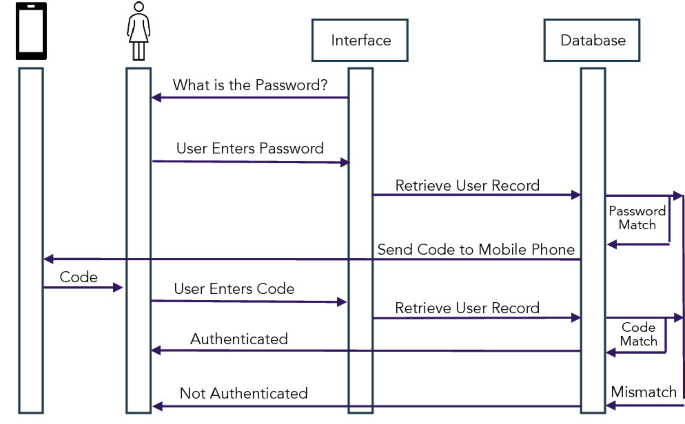

### **1. Introduction**

This project aims to develop a secure repository for managing organizational documents. We used **MongoDB** as the primary database for its flexibility in handling data, and **Docker** to simplify deployment. The `docker-compose.yml` file configures the MongoDB service with authentication and persistent storage, alongside the Flask application for seamless integration.

To run the system:  
- **Server**: Launch the server by running: 
  ```bash
  docker compose up --build
  ```  
- **Client**: Execute commands by running:  
  ```bash
  python3 subject.py <command> <args>
  ```  

---

### **2. Secure Operations**

The following sequence diagrams illustrate the secure workflows implemented in the project.

### **2.1 Local commands**

1. **Creating a Subject**  
   The process for creating a subject involves deriving a private key from the password using ECC (Elliptic-curve Cryptography), generating a public key, and securely storing the information in the organization’s database.  
   

    <!-- creating_subject -->

### **2.2 Commands that use the anonymous API**

We chose to explain the workflow of creating an organization, creating a session, and downloading a file as examples of the commands that use the anonymous API.

1. **Creating an Organization**  
   The workflow for creating an organization includes securely sending the organization data to the server, storing it in the database, and validating the response.  
   

    <!-- creating_organization -->

2. **Creating a Session**  
   The process of creating a session ensures secure communication between the client and the server using a combination of cryptographic processes:

   1. **Client-Side Key Generation**:  
      The client generates an ephemeral private key derived from their private key (itself derived from the password) and computes the corresponding ephemeral public key.

   2. **Wrapping and Signing Data**:  
      The client creates the `associated_data`, which includes the `organization`, `username`, and `client_ephemeral_public_key`. This data is signed using **ECDSA** (Elliptic Curve Digital Signature Algorithm) with **SHA-256** to ensure authenticity and integrity. The signed data, along with the `associated_data`, is sent to the server.

   3. **Server-Side Verification and Key Exchange**:  
      The server verifies the client's signature using the client's public key. It then generates its own ephemeral private and public keys. Using **ECDH** (Elliptic Curve Diffie-Hellman), the server calculates a `shared_key` based on its ephemeral private key and the client's ephemeral public key.

   4. **Key Derivation for Encryption**:  
      The `shared_key` is processed with **HKDF** (HMAC-based Key Derivation Function) to derive a `derived_key`, adding an additional layer of cryptographic protection for the session.

   5. **Session Information and Response**:  
      The server stores the session details and sends back the `session_id` and its `ephemeral_public_key`, signed with the server's private key to ensure authenticity.

   6. **Client Verification and Storage**:  
      The client verifies the server’s signature using the server's public key. It computes the `shared_key` and derives the same `derived_key` using the server’s ephemeral public key. Finally, the session details are saved to a `session_file` on the client side for future use.

   These cryptographic processes are illustrated in the sequence diagram below.  
   

   <!-- creating_session -->

3. **Downloads a file given its handle**
   
   The workflow for downloading a file ensures the integrity and authenticity of the retrieved content. The client requests the file using its handle, and the server locates and returns the file content along with a cryptographic signature. The signature, generated using the server's private key, verifies the integrity of the file and prevents man-in-the-middle attacks. Upon validation, the client can write the file content to the desired location or output it to stdout.  

     

   <!-- downloading_file -->

### **2.3 Commands that use the authenticated API**

We choose to explain the workflow of assuming a role as an example of the commands that use the authenticated API. In this chapter, we will also explain how the communication between the client and the server occurs.

1. **Assume a Role**  
The workflow for assuming a role allows a user to assume a specific role associated with their session. The client sends a request to the server, including the desired role. The server validates the user's active status and checks whether the user holds the requested role in the organization. If authorized, the server updates the session to include the role, and the client reflects this change in the local session file. This ensures role-based access control and prevents unauthorized role assignments.  

     

   <!-- assume_role -->

### **Secure Communication Workflow**

The secure communication between the client and server is achieved through a systematic process involving **data encapsulation**, **data transmission**, and **data decapsulation**. This ensures confidentiality, integrity, and protection against replay attacks.

### **Encryption Details**

- **Algorithm**: **AES-GCM** (Advanced Encryption Standard in Galois/Counter Mode) is used for both encryption and decryption. It ensures data confidentiality and integrity.
- **Keys**: The `derived_key` for encryption and decryption is established securely during session creation using **ECDH** and **HKDF**.
- **Associated Data**: This additional data (e.g., `msg_id` and `session_id`) is authenticated during encryption but not encrypted itself, preventing tampering.

Here is how it works:

---

1. **Client-Side Data Encapsulation**:
   - The client begins by preparing the data (`plaintext`) to be sent. 
   - Session-related metadata (`msg_id` and `session_id`) are grouped into `associated_data`, which is authenticated but not encrypted.
   - The `plaintext` is serialized into bytes and encrypted using the **AES-GCM** algorithm with the `derived_key`. The encryption process generates a random `nonce` and produces the `ciphertext`, ensuring confidentiality and integrity.
   - Both the `associated_data` and the encrypted data (`nonce` and `ciphertext`) are grouped into a JSON structure and sent to the server.

---

2. **Server-Side Data Decapsulation**:
   - Upon receiving the data, the server extracts and validates the `associated_data` to authenticate the session and verify the `msg_id` for replay attack prevention.
   - Using the stored session details, the server decrypts the `ciphertext` with **AES-GCM** using the `derived_key` and verifies the integrity of the associated data. If the integrity check fails, the process halts with an error.
   - The decrypted `plaintext` is then processed, and any required operations are performed on the server side.

---

3. **Server Response and Encapsulation**:
   - After completing the requested operation, the server prepares a response in plaintext.
   - The response is encapsulated similarly: `associated_data` (updated `msg_id` and `session_id`) is combined with the encrypted response (`nonce` and `ciphertext`) using **AES-GCM** to ensure the confidentiality and integrity of the response.
   - The encapsulated data is sent back to the client.

---

4. **Client-Side Data Decapsulation**:
   - Upon receiving the server's response, the client verifies the `associated_data`, ensuring the `msg_id` matches and the session is valid.
   - The encrypted response is decrypted using the `derived_key`, and the integrity of the response is checked. If validation is successful, the client processes the plaintext response.

---

This process ensures that every step of the communication is secure, authenticated, and resistant to attacks, such as replay and man-in-the-middle attacks.

### **2.4 Commands that use the authorized API**

All these commands use as first parameter a file with the session key. For that session, the subject must have added one or more roles.
We chose to explain the workflow of adding a subject to an organization as an example of the commands that use the authorized API.

1. **Add a new subject to the organization**

The workflow for adding a new subject to an organization begins with the client preparing the required data, including the subject's `username`, `name`, `email`, and `public key`. The public key is read from a credentials file, serialized, and included in the request. This information is encapsulated and encrypted using the session's derived_key for confidentiality and integrity. Once the server receives the data, it validates the session, checks the user's active state, and ensures that the session includes the `SUBJECT_NEW` permission. If these checks pass, the server adds the new subject to the organization's database with default properties, such as an "active" state. Finally, the server responds with a confirmation message, encapsulated and encrypted for secure transmission back to the client.


<!-- add_subject -->


